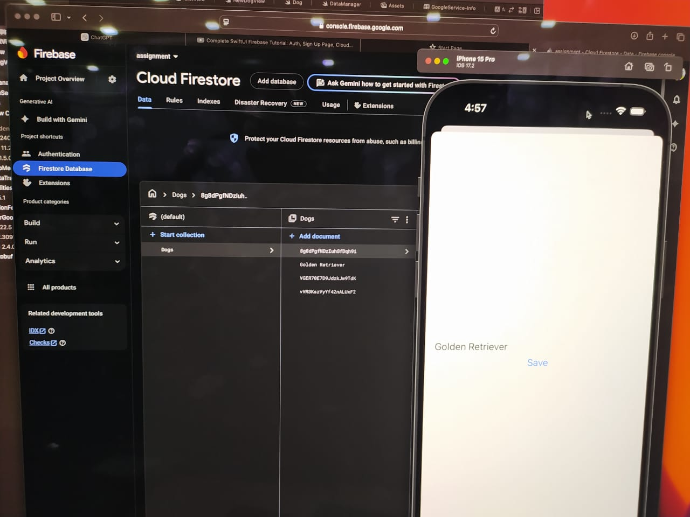
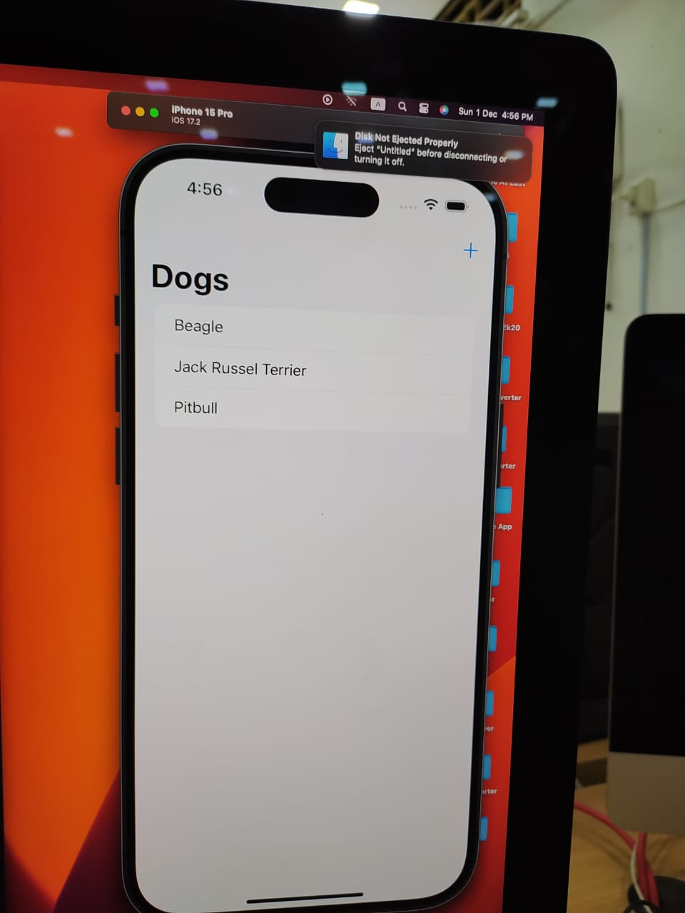
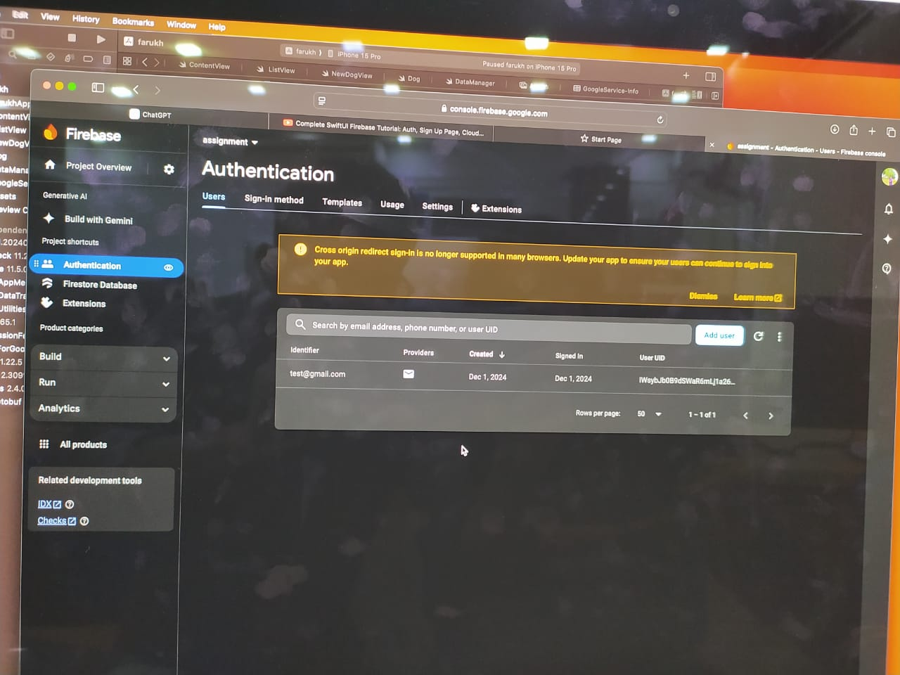
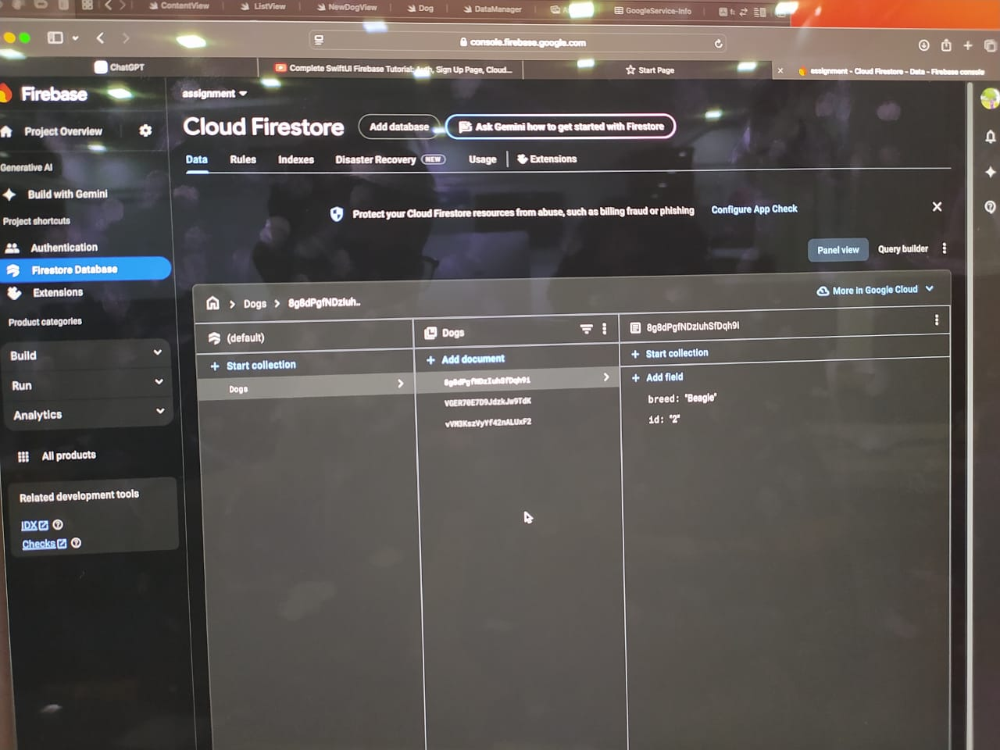

# Firebase Auth and Firestore App Project

Welcome to the **Firebase Auth and Firestore App Project** repository! This project is a collaborative effort by our team to create a beautiful and functional SwiftUI app integrated with Firebase for authentication and Firestore for data storage.

---

## 📂 Branches
This repository uses a **feature-specific branch structure** for collaborative development. Each team member works on a dedicated branch:

1. **`ryad`**: Focuses on designing and implementing UI components.
2. **`rafi`**: Handles Firebase authentication tasks.
3. **`farukh`**: Manages Firestore integration and database-related features.

**Important:** Always create a pull request (PR) when merging into the `main` branch to ensure code quality and team review.

---

## 👩‍💻 Team Members
- **Ryad** - Responsible for building and styling UI components.
- **Rafi** - Implements user authentication using Firebase.
- **Farukh** - Sets up Firestore database and manages data operations.

---
## 📸 Screenshots

### Login Screen


### Home Screen


### Sign-Up Form


### Firestore Integration


### Database View


### Additional Feature


## 🚀 Getting Started

### Prerequisites
1. Install [Xcode](https://developer.apple.com/xcode/).
2. Install the Firebase SDK for Swift by adding it via **Swift Package Manager**:
   - URL: `https://github.com/firebase/firebase-ios-sdk`
3. Ensure you have access to the Firebase console for project settings.

### Project Setup
1. Clone the repository:
   ```bash
   git clone https://github.com/<your-repo-name>.git
